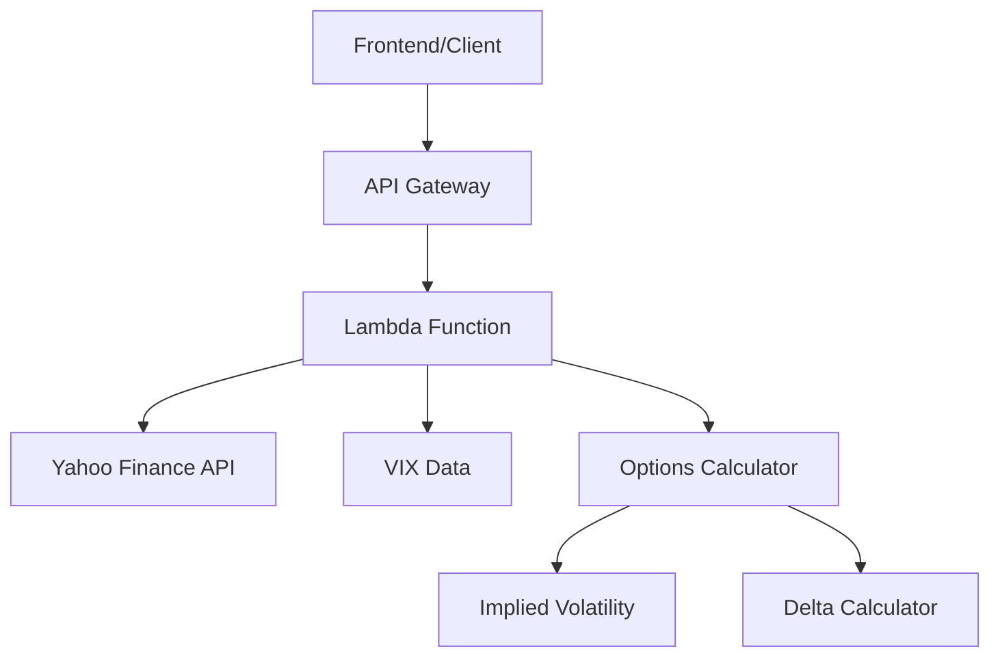

# Design Document

## Overview

The SPY Implied Volatility Serverless Backend is a comprehensive options analytics API built on AWS Lambda and API Gateway. The system provides real-time option chain data with calculated implied volatility and Greeks for any ticker, along with current VIX data. The architecture leverages existing yfinance integration patterns from the codebase while extending functionality for options analytics.

## Architecture

### High-Level Architecture



### AWS Infrastructure

- **API Gateway**: RESTful endpoint with CORS enabled
- **Lambda Function**: Python 3.9 runtime with 512MB memory and 30-second timeout
- **Serverless Framework**: Infrastructure as Code deployment
- **Native Packaging**: No Docker required, using serverless-python-requirements plugin

### Data Flow

1. Client makes GET request to `/options-analytics?ticker=SYMBOL`
2. API Gateway triggers Lambda function
3. Lambda fetches current stock price and VIX data from Yahoo Finance
4. Lambda retrieves all option chains for all expiration dates
5. Lambda calculates implied volatility and delta for each option
6. Lambda returns structured JSON response with timestamps

## Components and Interfaces

### API Endpoint

**Endpoint**: `GET /options-analytics`

**Query Parameters**:
- `ticker` (optional): Stock ticker symbol (defaults to "SPY")

**Response Structure**:
```json
{
  "ticker": "SPY",
  "stockPrice": 450.25,
  "vixValue": 18.75,
  "dataTimestamp": "2025-01-16T14:30:00Z",
  "vixTimestamp": "2025-01-16T14:30:00Z",
  "expirationDates": [
    {
      "expiration": "2025-01-17",
      "calls": [
        {
          "strike": 450.0,
          "lastPrice": 2.50,
          "impliedVolatility": 0.185,
          "delta": 0.52
        }
      ],
      "puts": [
        {
          "strike": 450.0,
          "lastPrice": 1.75,
          "impliedVolatility": 0.190,
          "delta": -0.48
        }
      ]
    }
  ]
}
```

### Core Components

#### 1. Options Data Fetcher
- Leverages existing yfinance patterns from `src/tools/api_yfinance.py`
- Fetches current stock price and VIX data
- Retrieves option chains for all available expiration dates
- Handles ticker symbol formatting (e.g., ^VIX for VIX data)

#### 2. Options Calculator
- **Implied Volatility Calculator**: Uses py_vollib Black-Scholes implementation
- **Delta Calculator**: Calculates delta using Black-Scholes model
- **Risk-Free Rate**: Configurable constant (default 1%)
- **Time to Expiration**: Calculated in years from current UTC time

#### 3. Data Processor
- Filters options with invalid calculations
- Structures data by expiration date
- Adds timestamps for data freshness
- Handles error cases gracefully

#### 4. Response Handler
- Formats JSON responses with proper CORS headers
- Handles error responses with appropriate HTTP status codes
- Ensures consistent response structure

## Data Models

### Option Data Model
```python
@dataclass
class OptionData:
    strike: float
    last_price: float
    implied_volatility: Optional[float]
    delta: Optional[float]
    option_type: str  # 'c' for call, 'p' for put
```

### Market Data Model
```python
@dataclass
class MarketData:
    ticker: str
    stock_price: float
    vix_value: float
    data_timestamp: datetime
    vix_timestamp: datetime
    expiration_dates: List[ExpirationData]
```

### Expiration Data Model
```python
@dataclass
class ExpirationData:
    expiration: str
    calls: List[OptionData]
    puts: List[OptionData]
```

## Error Handling

### Error Categories

1. **Data Fetch Errors**:
   - Stock price unavailable
   - VIX data unavailable
   - No option expiration dates found
   - Network timeouts

2. **Calculation Errors**:
   - Invalid implied volatility calculations
   - Delta calculation failures
   - Invalid time to expiration

3. **System Errors**:
   - Lambda timeout
   - Memory limitations
   - Unexpected exceptions

### Error Response Format
```json
{
  "error": "Error description",
  "errorType": "DATA_FETCH_ERROR|CALCULATION_ERROR|SYSTEM_ERROR",
  "timestamp": "2025-01-16T14:30:00Z"
}
```

### Error Handling Strategy

- **Graceful Degradation**: Include partial data when possible
- **Detailed Logging**: CloudWatch logs for debugging
- **Timeout Management**: Fail fast on network calls
- **Retry Logic**: Not implemented (stateless Lambda)

## Testing Strategy

### Unit Testing
- **Calculator Tests**: Verify implied volatility and delta calculations
- **Data Processing Tests**: Test option chain parsing and filtering
- **Error Handling Tests**: Validate error scenarios and responses

### Integration Testing
- **Yahoo Finance API**: Test data fetching with real API calls
- **End-to-End**: Full request/response cycle testing
- **Performance Testing**: Lambda execution time and memory usage

### Test Data Strategy
- **Mock Data**: Use sample option chain data for unit tests
- **Live Data**: Integration tests with real Yahoo Finance data
- **Edge Cases**: Test with various tickers and market conditions

### Testing Tools
- **pytest**: Primary testing framework
- **unittest.mock**: Mock external API calls
- **AWS SAM Local**: Local Lambda testing (optional)

## Performance Considerations

### Lambda Optimization
- **Memory Allocation**: 512MB for pandas/numpy operations
- **Timeout**: 30 seconds for API calls and calculations
- **Cold Start**: Minimize imports and initialization

### Data Processing Optimization
- **Vectorized Calculations**: Use pandas/numpy for bulk operations
- **Parallel Processing**: Calculate IV and delta simultaneously
- **Memory Management**: Process options in batches if needed

### Caching Strategy
- **No Persistent Caching**: Stateless Lambda design
- **Client-Side Caching**: Recommend client-side caching with timestamps
- **API Rate Limiting**: Rely on Yahoo Finance rate limits

## Security Considerations

### API Security
- **CORS Configuration**: Properly configured for frontend access
- **No Authentication**: Public API (as per requirements)
- **Rate Limiting**: Rely on AWS API Gateway throttling

### Data Security
- **No Sensitive Data**: Only public market data
- **Input Validation**: Validate ticker symbols
- **Error Information**: Avoid exposing internal system details

## Deployment Configuration

### Serverless Framework Configuration
```yaml
service: options-analytics-api
frameworkVersion: '3'

provider:
  name: aws
  runtime: python3.9
  region: us-east-1
  timeout: 30
  memorySize: 512

functions:
  optionsAnalytics:
    handler: handler.get_options_analytics
    events:
      - http:
          path: /options-analytics
          method: get
          cors: true

plugins:
  - serverless-python-requirements

custom:
  pythonRequirements:
    dockerizePip: false
```

### Dependencies
- **yfinance**: Market data fetching (already in project)
- **py_vollib**: Options calculations (new dependency)
- **pandas**: Data processing (already in project)
- **numpy**: Numerical calculations (already in project)

## Monitoring and Observability

### CloudWatch Metrics
- **Invocation Count**: Track API usage
- **Duration**: Monitor execution time
- **Error Rate**: Track failure percentage
- **Memory Usage**: Monitor resource consumption

### Logging Strategy
- **Structured Logging**: JSON format for parsing
- **Request Tracing**: Include request ID in logs
- **Performance Metrics**: Log calculation times
- **Error Details**: Comprehensive error logging

### Alerting
- **High Error Rate**: Alert on >5% error rate
- **Long Duration**: Alert on >25 second execution
- **Memory Issues**: Alert on memory warnings